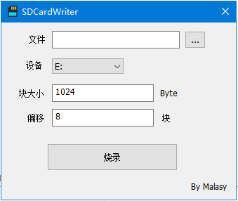

### 简介
SDCardWriter是一个Window平台的SD卡烧录工具，其功能类似于Linux上的dd。

### 开发意图
烧写嵌入式的裸机程序到tf卡。  
编译程序在Win10的WSL上，但烧录一直没找到能用的工具，干脆自己写一个，也顺便学习一下烧录的原理。

### 感谢
[win32diskimager-qt5](https://github.com/anpho/win32diskimager-qt5)
